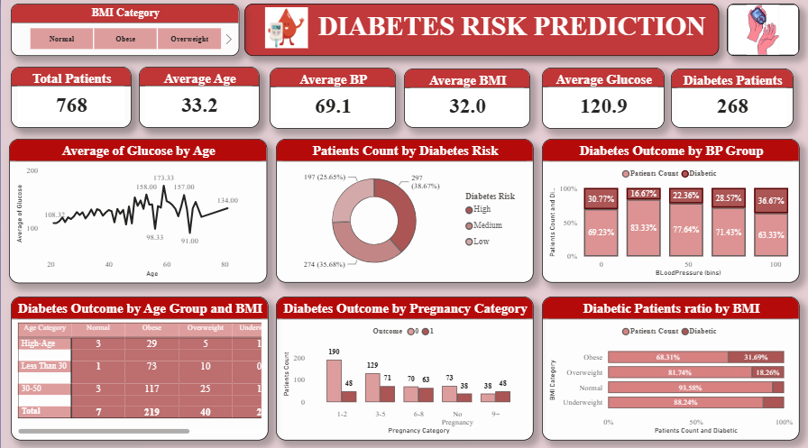

# 🩺 Diabetes Healthcare Analytics & Risk Prediction

## 📌 Project Overview

An end-to-end healthcare analytics project that analyzes diabetes patient data, identifies key health indicators, and predicts diabetes risk using machine learning. An interactive Power BI dashboard provides actionable insights for healthcare professionals.

---

## 🎯 Business Problem

Early identification of high-risk diabetic patients helps healthcare providers improve treatment planning and reduce complications. This project analyzes patient health records to uncover patterns and support data-driven decisions.

---

## 🚀 Technologies Used

- Python
- Pandas
- NumPy
- Matplotlib
- Scikit-learn
- Power BI
- Git & GitHub

---

## 📂 Project Structure

```
Diabetes-Healthcare-Analytics/
│
├── data/
├── notebook/
├── src/
├── dashboard/
└── README.md
```

---

## 📊 Dashboard Preview



---

## 🤖 Machine Learning Models

- Logistic Regression
- Decision Tree
- Random Forest

---

## 📈 Key Insights

- Analyzed patient health records to identify diabetes risk factors.
- Performed data cleaning and exploratory data analysis (EDA).
- Compared multiple machine learning models using Accuracy, Cross Validation, and ROC-AUC.
- Built an interactive Power BI dashboard to visualize patient health metrics.

---

## 💼 Skills Demonstrated

- Data Cleaning
- Exploratory Data Analysis (EDA)
- Data Visualization
- Machine Learning
- Model Evaluation
- Healthcare Analytics
- Dashboard Development
- Business Insights

---

## ⭐ Author

**Srividya Samudrala**

GitHub: https://github.com/samudrala-srividya
